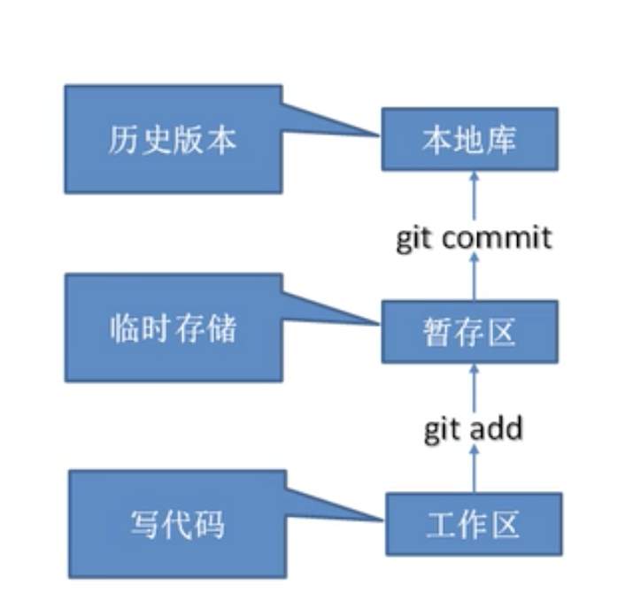

# Git教程

- 概念:

  - 免费开源的分布式版本控制工具,可以快速高效的地处理从小到大的各种项目
  - Git易于学习,占地面积小,性能极快，它具有廉价的本地库,方便的暂存区域和多个工作流分支等等,其性能优于SVN，CVS等版本控制工具

- 版本控制概念:

  - 版本控制是一种记录文件变化的内容,以便将来查阅特定版本修订情况的系统,版本控制其实最重要的事,可以记录文件修改历史记录，从而让用户能够查看历史版本

- 官网:

  - https://git-scm.com

- 工作机制:

  - 

- Git和代码托管中心:

  - 代码托管中心是基于网络服务器的远程代码仓库，一般我们称为远程库
    - 局域网:GitLib
    - 互联网:GitHub(国外) Gitee(国内码云)

- 安装:

- Git常用命令:

  - 1.设置签名:该签名的作用主要是用来区分不同的操作着身份,用户的签名信息在每一版本的提交信息中都可以看到，一次来确认本次提交信息是谁来做的，

  - 注意:Git首次安装必须设置一下用户签名,否则无法提交代码,这里设置的签名是可以随意设置的

  - ```shell
    # 设置全局的用户名
    git config --global user.name yantianpeng‘
    #设置全局邮箱
    git cofig --global user.email hkdyantianpeng@163.com
    ```

  - 2.初始化仓库: 该命令运行完毕之后,会生成一个.git 的隐藏文件 表示该文件夹可被git管理，需要注意的是该命令只可以初始化空的文件夹。

    - git init

  - 3.查看文件的状态:

    - git status 

  - 4.添加文件到暂存区:

    - git add 文件名称 添加指定的文件到暂存区域
    - git add . 添加所有的文件到暂存区域

  - 5.添加文件到本地库

    - git commit -m "备注" 文件名

  - 6.从暂存区删除文件

    - git rm --cached 文件名称

  - 7.查看操作日志:

    - git log

  - 8.显示可引用的历史版本记录

    - git reflog

  - 版本穿梭:可以在不同的版本中来回更新

    - git reset --hard 版本号
    - 版本号可以通过第七个命令来查看

  - 创建分支:

    - git branch 分支名称 

  - 查看分支状态:

    - git branch -v 

  - 切换分支:

    - git checkout 分支名称

  - 合并分支:

    - git merge 分支名称--表示把其他分支的内容合并到当前分支上

- Git团队协作:

  - 创建远程仓库别名:
    - git remote -v  查看当前所有远程库的别名

    - git remote add 别名 远程地址  创建远程仓库别名

  - 本地代码推送到远程仓库
    - git push 远程仓库别名 分支名称

  - 
